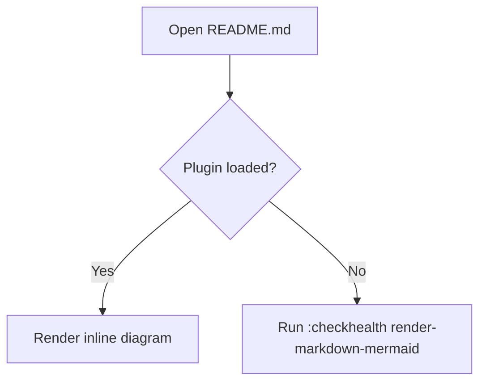
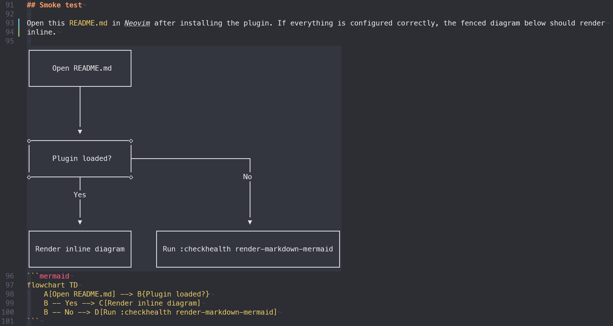

# render-markdown-mermaid.nvim

Render fenced `mermaid` code blocks inline in Neovim by combining `render-markdown.nvim` with Beautiful Mermaid (`bm`) or `mermaid-ascii`.
The default setup attaches to both Markdown and MDX buffers.

## Requirements

- Neovim `0.10+`
- [`nvim-treesitter`](https://github.com/nvim-treesitter/nvim-treesitter) with `markdown` and `markdown_inline` parsers
- [`render-markdown.nvim`](https://github.com/MeanderingProgrammer/render-markdown.nvim)
- Beautiful Mermaid (`bm`) in your `PATH` (preferred), or `mermaid-ascii`

## Install a renderer

This plugin shells out to an external Mermaid CLI. Install one of these and make sure the executable is on your `PATH`.

`bm` is the recommended backend. It has much better Mermaid compatibility and renders substantially more diagram types and syntax than
`mermaid-ascii`. `mermaid-ascii` is still useful as a lightweight fallback when you only need its supported subset.

### Preferred: `bm`

`bm` is provided by [`beautiful-mermaid-cli`](https://www.npmjs.com/package/beautiful-mermaid-cli), which uses the
[`beautiful-mermaid`](https://github.com/lukilabs/beautiful-mermaid) renderer.

```bash
# npm
npm i -g beautiful-mermaid-cli

# Bun
bun add -g beautiful-mermaid-cli

# Homebrew
brew install okooo5km/tap/bm
```

### Fallback: `mermaid-ascii`

`mermaid-ascii` is available on npm at [`mermaid-ascii`](https://www.npmjs.com/package/mermaid-ascii), but it supports a smaller subset of
Mermaid syntax than `bm`.

```bash
# npm
npm i -g mermaid-ascii

# Homebrew
brew install cavanaug/tap-extras/mermaid-ascii
```

After installing either renderer, restart Neovim or ensure your shell `PATH` is visible to Neovim, then run:

```vim
:checkhealth render-markdown-mermaid
```

## Install with lazy.nvim

This plugin can set up `render-markdown.nvim` for you, so the default install is just one block:

```lua
{
    'cavanaug/render-markdown-mermaid.nvim',
    dependencies = {
        'nvim-treesitter/nvim-treesitter',
        'MeanderingProgrammer/render-markdown.nvim',
    },
    build = ':TSUpdate markdown markdown_inline',
    opts = {},
}
```

If you want custom options, put them in that same `opts` table:

```lua
{
    'cavanaug/render-markdown-mermaid.nvim',
    dependencies = {
        'nvim-treesitter/nvim-treesitter',
        'MeanderingProgrammer/render-markdown.nvim',
    },
    build = ':TSUpdate markdown markdown_inline',
    opts = {
        placement = 'below',
        mode = 'ascii',
        render_markdown = {
            code = { border = 'thin' },
        },
    },
}
```

## Smoke test

Open this `README.md` in Neovim after installing the plugin. If everything is configured correctly, the fenced diagram below should render
inline.

### Mermaid Inline/Source



### Mermaid PNG Render



## Options

```lua
{
    mode = 'unicode', -- default: Unicode box-drawing; use 'ascii' for ASCII fallback
    placement = 'above', -- render above or below the raw mermaid fence while editing
    replace = false, -- visually replace the fence in normal mode when not editing that block
    cmd = { 'bm' }, -- resolved command when bm is selected; omit cmd to use automatic selection
    auto_setup_render_markdown = true,
    debounce = 150,
    timeout = 2000,
    cache = true,
    hide_source = false,
    max_block_lines = 200,
    render_markdown = {
        file_types = { 'markdown', 'mdx', 'markdown.mdx' },
    },
    cli = {
        border_padding = 1,
        padding_x = 5,
        padding_y = 5,
    },
}
```

`placement` controls whether the rendered diagram is shown `above` or `below` the raw mermaid fence while editing. The default is `above`.

`replace = true` visually replaces the raw mermaid fence in normal mode whenever your cursor is outside that block. Entering that block or
entering insert mode reveals the source again and falls back to `placement`.

`mode` controls whether text renderers use Unicode box-drawing characters (`unicode`) or plain ASCII fallback characters (`ascii`). The
default is `unicode`.

If you do not set `cmd`, the plugin prefers `bm` and falls back to `mermaid-ascii` when `bm` is unavailable.

`hide_source = true` will conceal the raw mermaid fence whenever your cursor is outside that fence, leaving the rendered diagram visible.

## Health check

Run:

```vim
:checkhealth render-markdown-mermaid
```

This checks for:

- `render-markdown.nvim`
- `bm`
- `mermaid-ascii`
- which renderer will be selected by default
- treesitter parsers for `markdown` and `markdown_inline`
- a modern enough Neovim / treesitter runtime

`render-markdown.nvim` may still show optional warnings for LaTeX support if you do not have the `latex` parser or a converter like `utftex`
/ `latex2text` installed. Those warnings are only relevant if you want LaTeX rendering in markdown.
