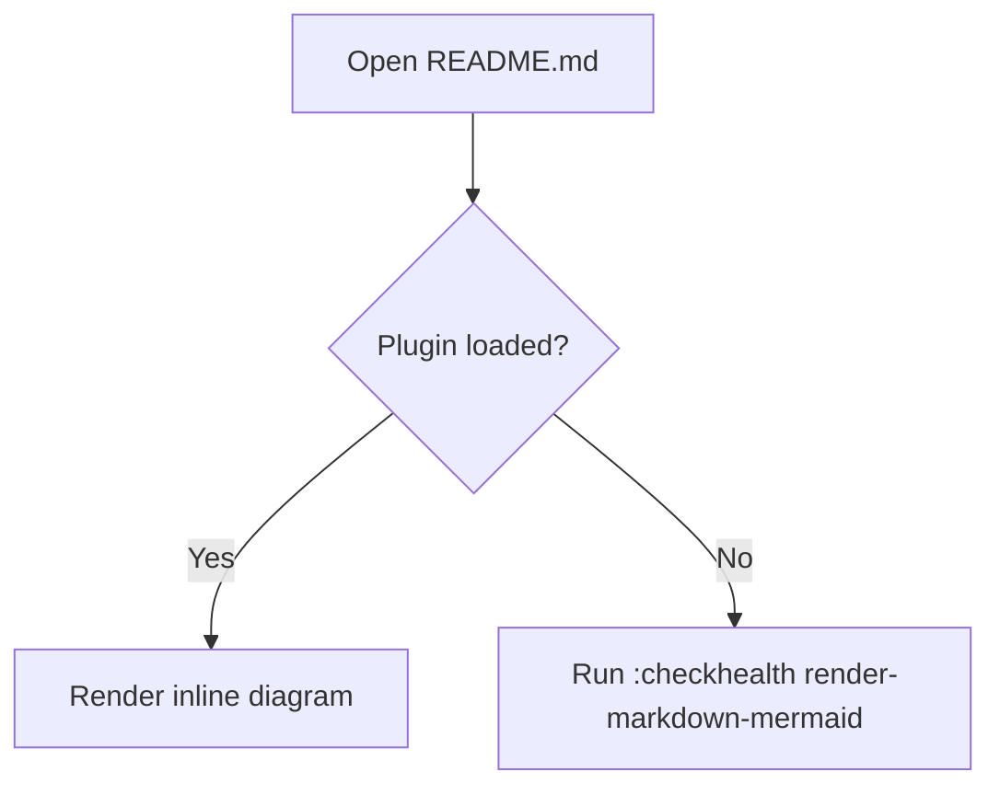

# render-markdown-mermaid.nvim

Render fenced `mermaid` code blocks inline in Neovim by combining `render-markdown.nvim` with `mermaid-ascii`.
The default setup attaches to both Markdown and MDX buffers.

## Requirements

- Neovim `0.10+`
- [`nvim-treesitter`](https://github.com/nvim-treesitter/nvim-treesitter) with `markdown` and `markdown_inline` parsers
- [`render-markdown.nvim`](https://github.com/MeanderingProgrammer/render-markdown.nvim)
- `mermaid-ascii` in your `PATH`

## Install with lazy.nvim

This plugin can set up `render-markdown.nvim` for you, so the default install is just one block:

```lua
{
    'cavanaug/render-markdown-mermaid.nvim',
    dependencies = {
        'nvim-treesitter/nvim-treesitter',
        'MeanderingProgrammer/render-markdown.nvim',
    },
    build = ':TSUpdate markdown markdown_inline',
    opts = {},
}
```

If you want custom options, put them in that same `opts` table:

```lua
{
    'cavanaug/render-markdown-mermaid.nvim',
    dependencies = {
        'nvim-treesitter/nvim-treesitter',
        'MeanderingProgrammer/render-markdown.nvim',
    },
    build = ':TSUpdate markdown markdown_inline',
    opts = {
        mode = 'below_raw',
        render_markdown = {
            code = { border = 'thin' },
        },
    },
}
```

## Smoke test

Open this `README.md` in Neovim after installing the plugin. If everything is configured correctly, the fenced diagram below should render inline.



## Options

```lua
{
    mode = 'below_raw', -- below_raw | replace_raw | disabled
    cmd = { 'mermaid-ascii' },
    auto_setup_render_markdown = true,
    debounce = 150,
    timeout = 2000,
    cache = true,
    hide_source = false,
    max_block_lines = 200,
    render_markdown = {
        file_types = { 'markdown', 'mdx', 'markdown.mdx' },
    },
    cli = {
        ascii = false,
        border_padding = 1,
        padding_x = 5,
        padding_y = 5,
    },
}
```

`hide_source = true` will conceal the raw mermaid fence whenever your cursor is outside that fence, leaving the rendered diagram visible.

## Health check

Run:

```vim
:checkhealth render-markdown-mermaid
```

This checks for:

- `render-markdown.nvim`
- `mermaid-ascii`
- treesitter parsers for `markdown` and `markdown_inline`
- a modern enough Neovim / treesitter runtime

`render-markdown.nvim` may still show optional warnings for LaTeX support if you do not have the `latex` parser or a converter like `utftex` / `latex2text` installed. Those warnings are only relevant if you want LaTeX rendering in markdown.
