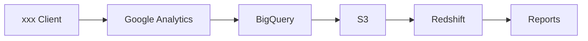
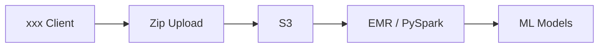

# Header

## Current State

### Event Telemetry vs ML Data Feed

**Current — Event Telemetry (Redshift via S3):**

```mermaid
graph LR
xxx[xxx Client] --> GA[Google Analytics]
GA --> BQ[BigQuery]
BQ --> S3[S3]
S3 --> Redshift
Redshift --> Analytics[Reports]
```

**Current — ML Zip File Telemetry:**

```mermaid
graph LR
xxx[xxx Client] --> ZipUpload[Zip Upload]
ZipUpload --> S3[S3]
S3 --> EMR[EMR / PySpark]
EMR --> Models[ML Models]
```
