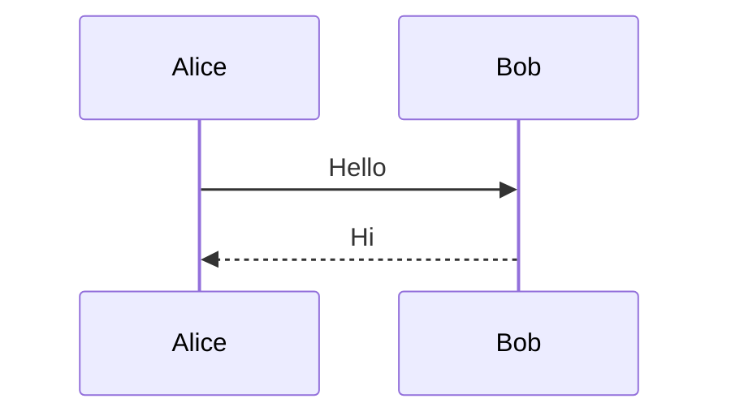
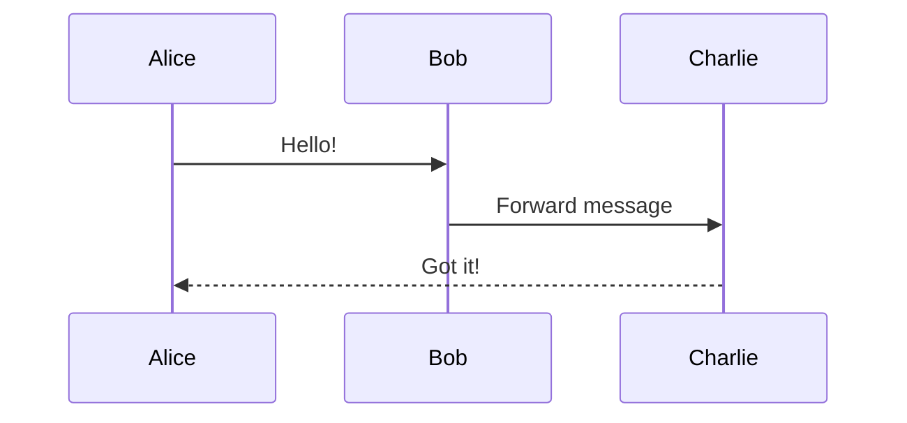
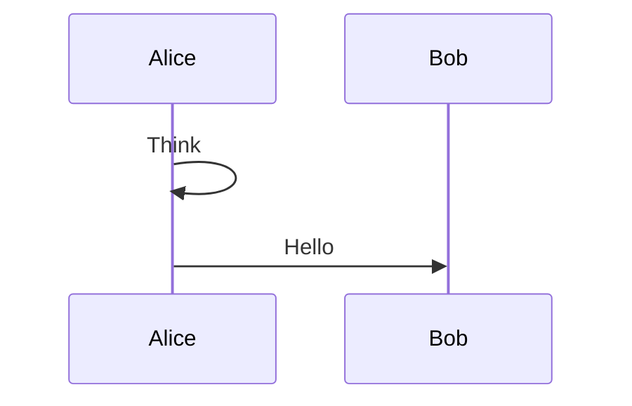
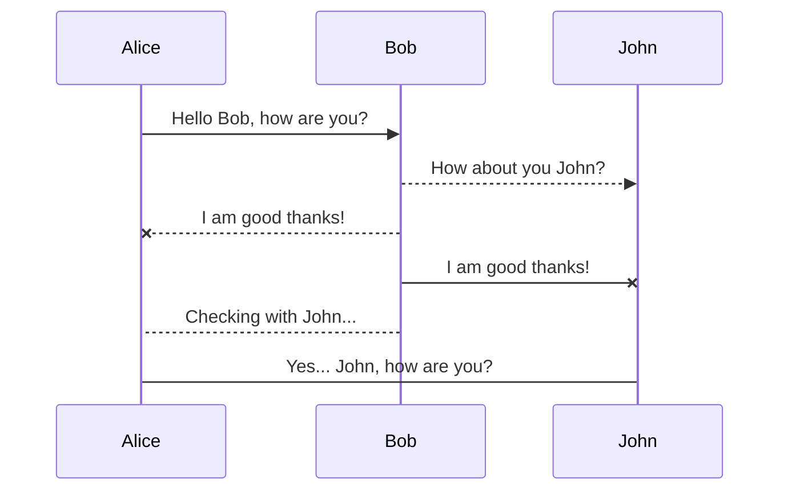

### Sequence Diagram - Supported

```mermaid
sequenceDiagram
    Alice->>Bob: Hello
    Bob-->>Alice: Hi
```

### Sequence Diagram Multi - Supported

```mermaid
sequenceDiagram
Alice->>Bob: Hello!
Bob->>Charlie: Forward message
Charlie-->>Alice: Got it!

```

### Sequence Diagram Multi - Supported

```mermaid
sequenceDiagram
Alice->>Alice: Think
Alice->>Bob: Hello
```

### Sequence Diagram - Unsupported

```mermaid
sequenceDiagram
    Alice ->> Bob: Hello Bob, how are you?
    Bob-->>John: How about you John?
    Bob--x Alice: I am good thanks!
    Bob-x John: I am good thanks!
    Bob-->Alice: Checking with John...
    Alice->John: Yes... John, how are you?
```
